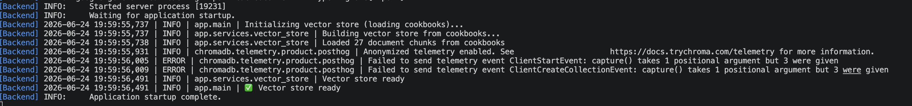
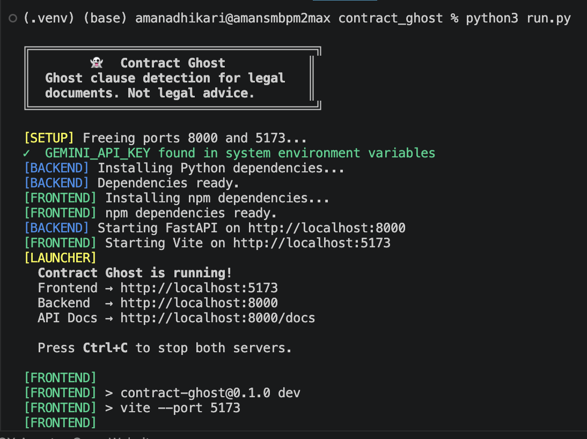
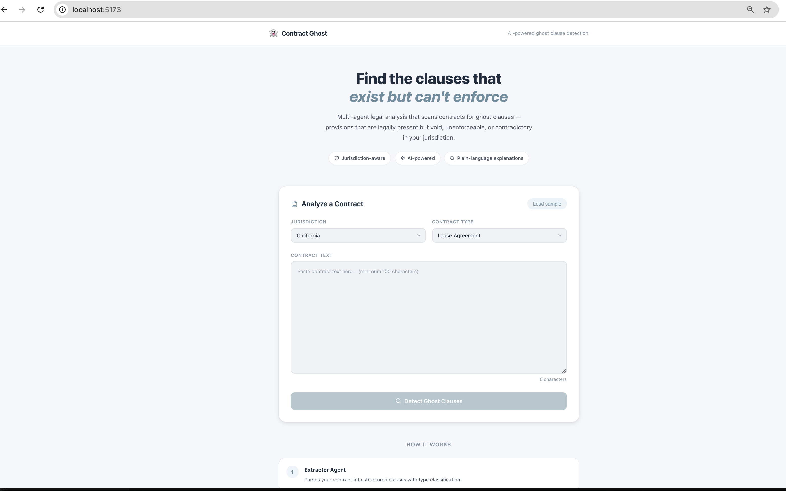
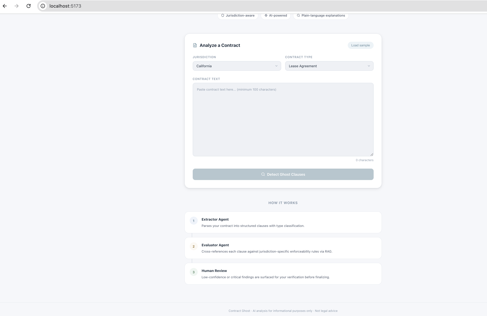
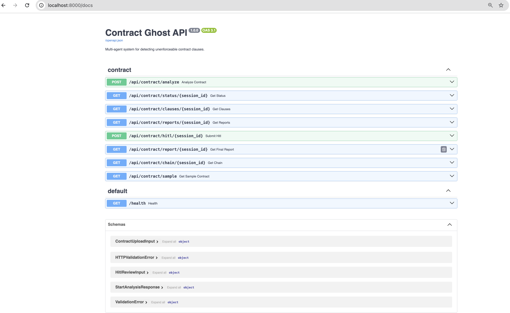
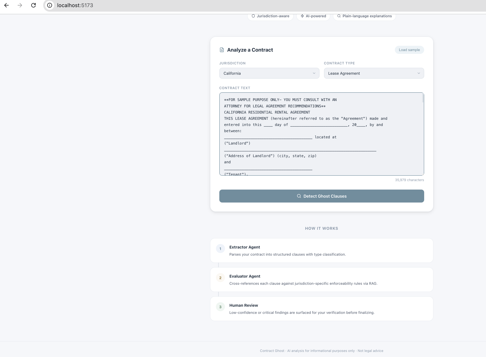
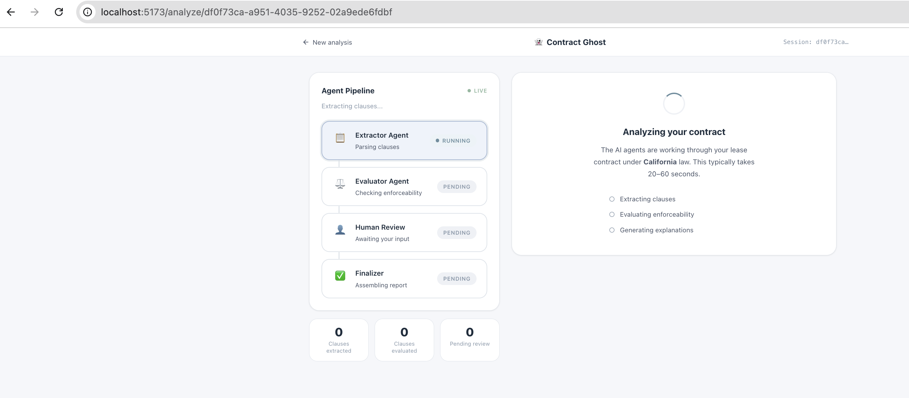
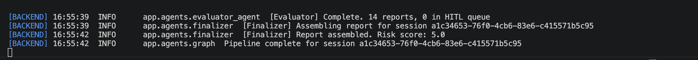
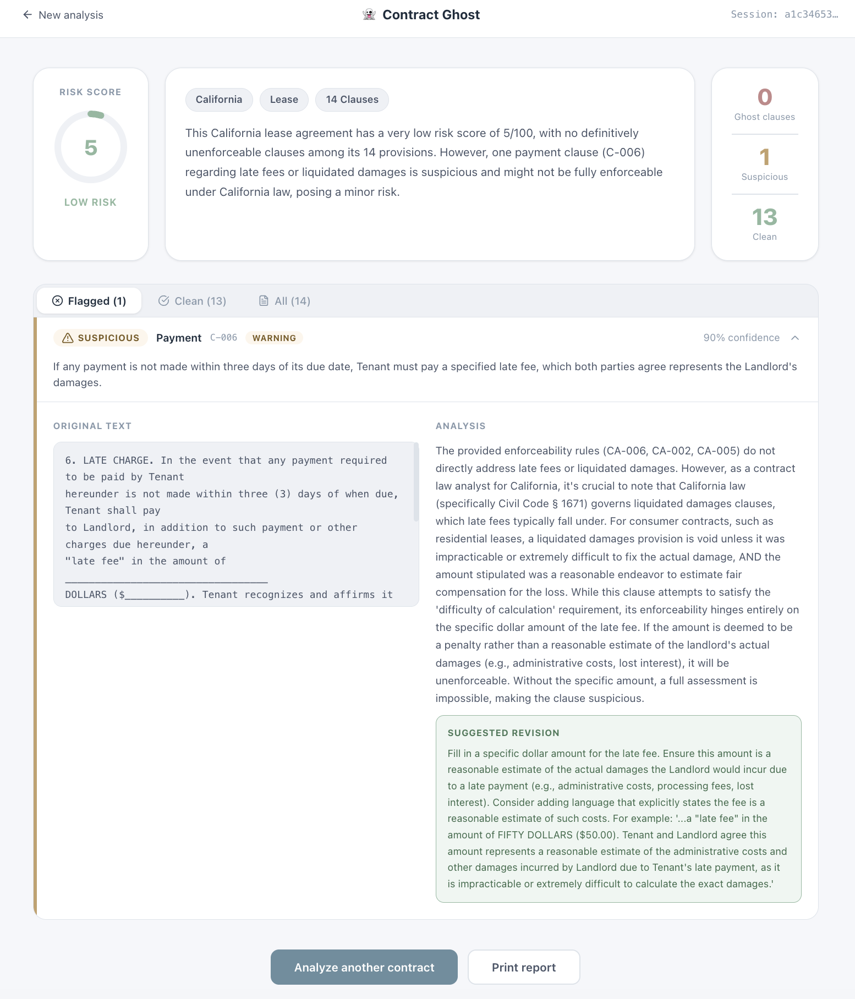
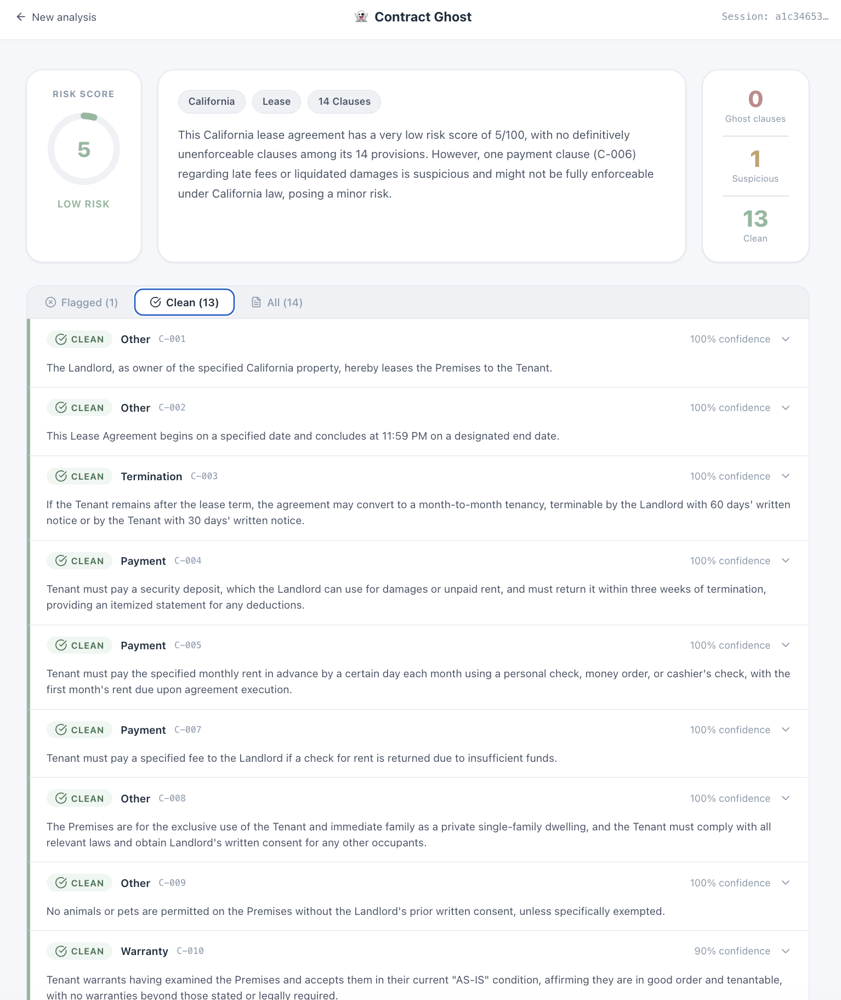

<h1 align="center">👻 Contract Ghost</h1>

<p align="center">
  <strong>AI-powered multi-agent system that finds the clauses in your contracts that exist on paper — but can't hold up in court.</strong>
</p>

<p align="center">
  <a href="https://github.com/yourusername/contract-ghost/blob/main/LICENSE">
    
  </a>
  <a href="https://www.python.org/downloads/">
    
  </a>
  <a href="https://nodejs.org/">
    
  </a>
  <a href="https://fastapi.tiangolo.com/">
    
  </a>
  <a href="https://react.dev/">
    
  </a>
  
</p>

<p align="center">
  <a href="#-quick-start">Quick Start</a> ·
  <a href="#-screenshots">Screenshots</a> ·
  <a href="#-architecture">Architecture</a> ·
  <a href="#-api-reference">API Reference</a> ·
  <a href="#-contributing">Contributing</a> ·
  <a href="#-license">License</a>
</p>

---

> **Disclaimer:** Contract Ghost is for informational purposes only and does not constitute legal advice. Always consult a qualified attorney before relying on these findings.

---

## What is Contract Ghost?

Contracts are full of **ghost clauses** — provisions that look enforceable on the surface but are actually void, unenforceable, or contradictory under the law of the governing jurisdiction. They get signed, they get forgotten, and then they either get weaponized unfairly or collapse in court when it matters.

Contract Ghost is a two-agent AI pipeline that reads your contract, classifies every clause, cross-references it against a curated database of jurisdiction-specific enforceability rules, and produces a risk-scored report in plain English — with suggested revisions for every problematic clause it finds.

**Supported jurisdictions:** California · New York · Texas · Federal · EU

**Supported contract types:** Lease · Employment · Terms of Service · NDA · Other

---

## 🚀 Quick Start

### Prerequisites

| Requirement | Version | Notes |
|-------------|---------|-------|
| Python | 3.11+ | [python.org](https://www.python.org/downloads/) |
| Node.js | 18+ | [nodejs.org](https://nodejs.org/) |
| Google Gemini API Key | — | [Get one free](https://aistudio.google.com/apikey) |

### One-command setup

```bash
git clone https://github.com/yourusername/contract-ghost.git
cd contract-ghost
python run.py
```

The launcher handles everything:

- Prompts for your `GEMINI_API_KEY` and writes `backend/.env`
- Installs Python dependencies via `pip`
- Installs npm dependencies via `npm install`
- Starts backend on `http://localhost:8000` and frontend on `http://localhost:5173` in parallel with color-coded output
- Shuts both down cleanly on `Ctrl+C`

Then open **http://localhost:5173** in your browser. Click **Load sample** to try an example California residential lease with several ghost clauses pre-loaded.

### Manual setup

If you prefer to run each server independently:

```bash
# 1. Backend
cd backend
cp .env.example .env
# Edit .env and add your GEMINI_API_KEY
pip install -r requirements.txt
python run.py
# Backend running at http://localhost:8000
# Interactive API docs at http://localhost:8000/docs
```

```bash
# 2. Frontend (separate terminal)
cd frontend
npm install
npm run dev
# Frontend running at http://localhost:5173
```

### Environment variables

Create `backend/.env` (or copy from `.env.example`):

```bash
# Required
GEMINI_API_KEY=your_gemini_api_key_here

# Optional — these are the defaults
GEMINI_MODEL=gemini-1.5-flash
GEMINI_EMBEDDING_MODEL=models/embedding-001
BACKEND_PORT=8000
FRONTEND_PORT=5173
```

---

## 📸 Screenshots

### Logs once app is running successfully





### Home — Contract upload







Paste any contract, select your jurisdiction and contract type, and hit **Detect Ghost Clauses**. Use **Load sample** to try the demo California lease immediately.


---

### Analysis — Live agent pipeline

Watch the two AI agents work in real time. The left panel shows each agent's status and output summary as it streams in. Stats update live as clauses are extracted and evaluated.



---

### Report

When the Evaluator Agent flags a clause with low confidence or critical severity, it pauses and surfaces it for your review. You see the original clause text side-by-side with the AI's analysis, matched statute, and suggested revision. Choose **Confirmed Ghost**, **False Positive**, or **Unsure** — your verdict feeds directly back into the final report.



---

### Final Report — Risk-scored clause breakdown

The report shows an overall risk score (0–100), a plain-language executive summary, and a full sortable clause breakdown. Toggle between **Flagged**, **Clean**, and **All** views. Expand any clause to see the original text, the matched enforceability rule with statute citation, and a concrete suggested revision.





> **Adding screenshots:** Place your screenshots at `docs/images/screenshot-home.png`, `screenshot-analysis.png`, `screenshot-hitl.png`, and `screenshot-report.png`. Standard capture size is 1560×980px (@2x), exported at 50% for the README.

---

## 🏗 Architecture

### System overview

```
┌─────────────────────────────────────────────────────────────┐
│                        Browser                              │
│   React 18 + TypeScript + CSS Modules + React Router       │
│                                                             │
│   Home  ──►  AnalysisPage (polls /status)  ──►  ReportPage │
│                     │                                       │
│              HitlReview modal (on demand)                   │
└────────────────────────┬────────────────────────────────────┘
                         │  HTTP / JSON  (Vite proxy → :8000)
┌────────────────────────▼────────────────────────────────────┐
│                    FastAPI + Uvicorn                         │
│                                                             │
│   POST /api/contract/analyze                                │
│   GET  /api/contract/status/{id}   (polled every 2s)       │
│   POST /api/contract/hitl/{id}                             │
│   GET  /api/contract/report/{id}                            │
└────────────────────────┬────────────────────────────────────┘
                         │
┌────────────────────────▼────────────────────────────────────┐
│                  LangGraph Pipeline                          │
│                                                             │
│  START                                                      │
│    │                                                        │
│    ▼                                                        │
│  [Extractor Agent]  ── Gemini 1.5 Flash ──────────────     │
│    │  Parses contract → list[Clause]                        │
│    │                                                        │
│    ▼                                                        │
│  [Evaluator Agent]  ── Gemini + ChromaDB RAG ──────────    │
│    │  Checks each clause → list[GhostClauseReport]         │
│    │                                                        │
│    ├─── confidence < 0.7 OR severity == critical ──────    │
│    │                    │                                   │
│    │              [HITL Gate]  ── interrupt() ──────────   │
│    │                    │  User submits verdict             │
│    │                    │                                   │
│    ▼                    ▼                                   │
│  [Finalizer]  ── Assembles FinalReport + risk score        │
│    │                                                        │
│   END                                                       │
└─────────────────────────────────────────────────────────────┘
```

### Project structure

```
contract_ghost/
│
├── run.py                          # Master launcher — starts both servers
│
├── backend/
│   ├── .env.example                # Copy to .env and add your API key
│   ├── requirements.txt
│   ├── run.py                      # Uvicorn launcher (used by master)
│   └── app/
│       ├── main.py                 # FastAPI app, CORS, lifespan hooks
│       ├── config.py               # Pydantic Settings (reads .env)
│       │
│       ├── models/
│       │   ├── schemas.py          # All Pydantic v2 request/response models
│       │   └── state.py            # LangGraph TypedDict state definition
│       │
│       ├── agents/
│       │   ├── extractor_agent.py  # Clause extraction via Gemini
│       │   ├── evaluator_agent.py  # Enforceability evaluation via RAG
│       │   ├── finalizer.py        # Report assembly + risk score
│       │   └── graph.py            # LangGraph state machine + HITL logic
│       │
│       ├── services/
│       │   ├── vector_store.py     # ChromaDB init, seeding, similarity search
│       │   ├── rules_loader.py     # Loads unenforceability_rules.json
│       │   └── session_store.py    # Thread-safe in-memory session state
│       │
│       ├── routers/
│       │   └── contract.py         # All /api/contract/* endpoints
│       │
│       └── data/
│           ├── legal_rules/
│           │   └── unenforceability_rules.json   # 25 curated rules (CA/NY/TX/Fed/EU)
│           └── sample_contracts/
│               └── sample_lease_ca.txt           # Demo contract
│
├── frontend/
│   ├── index.html
│   ├── vite.config.ts              # Vite + proxy to :8000
│   ├── tsconfig.json
│   ├── package.json
│   └── src/
│       ├── main.tsx                # React entry point
│       ├── App.tsx                 # Router (Home / AnalysisPage / ReportPage)
│       ├── index.css               # Global CSS design tokens
│       │
│       ├── types/index.ts          # Full TypeScript type definitions
│       ├── services/api.ts         # Typed fetch wrapper for all endpoints
│       ├── hooks/usePolling.ts     # Generic polling hook
│       │
│       ├── pages/
│       │   ├── Home.tsx / .module.css
│       │   ├── AnalysisPage.tsx / .module.css
│       │   └── ReportPage.tsx / .module.css
│       │
│       └── components/
│           ├── AgentChainVisualizer.tsx / .module.css
│           └── HitlReview.tsx / .module.css
│
└── docs/
    └── images/                     # Place your screenshots here
```

### Agent details

| Agent | Input | Output | Model | Tools |
|-------|-------|--------|-------|-------|
| **Extractor** | Raw contract text + contract type | `list[Clause]` — typed, line-numbered | Gemini 1.5 Flash | Regex fallback extractor |
| **Evaluator** | `Clause` + jurisdiction | `GhostClauseReport` — with `ghost_status`, `severity`, `confidence_score` | Gemini 1.5 Flash | ChromaDB similarity search |
| **Finalizer** | All `GhostClauseReport` objects | `FinalReport` — risk score 0–100, executive summary | Gemini 1.5 Flash | — |

### RAG pipeline

The enforceability rules database (`unenforceability_rules.json`) contains 25 curated rules across 5 jurisdictions. At startup, these are embedded and loaded into a ChromaDB in-memory collection. At evaluation time, each clause triggers a similarity search filtered by jurisdiction, returning the top 3 matching rules which are injected into the evaluator prompt.

To add your own rules, append entries to `backend/app/data/legal_rules/unenforceability_rules.json` following the existing schema and restart the backend.

---

## 📡 API Reference

Interactive docs are available at **http://localhost:8000/docs** when the backend is running.

| Method | Endpoint | Auth | Description |
|--------|----------|------|-------------|
| `POST` | `/api/contract/analyze` | — | Start the analysis pipeline. Returns `session_id`. |
| `GET` | `/api/contract/status/{id}` | — | Poll pipeline state (current step, clause counts, HITL queue). |
| `GET` | `/api/contract/clauses/{id}` | — | Retrieve extracted clauses after Extractor completes. |
| `GET` | `/api/contract/reports/{id}` | — | Retrieve ghost clause reports after Evaluator completes. |
| `POST` | `/api/contract/hitl/{id}` | — | Submit a human review verdict for a flagged clause. |
| `GET` | `/api/contract/report/{id}` | — | Retrieve the final `FinalReport` (202 if not ready). |
| `GET` | `/api/contract/chain/{id}` | — | Retrieve the full agent step log. |
| `GET` | `/api/contract/sample` | — | Load the built-in demo contract. |
| `GET` | `/health` | — | Health check. |
| `GET` | `/docs` | — | Swagger UI. |

#### Example: start an analysis

```bash
curl -X POST http://localhost:8000/api/contract/analyze \
  -H "Content-Type: application/json" \
  -d '{
    "contract_text": "LEASE AGREEMENT...",
    "jurisdiction": "California",
    "contract_type": "lease"
  }'
```

```json
{
  "session_id": "f3a2b1c0-...",
  "status": "started",
  "message": "Analysis pipeline started. Poll /contract/status/{session_id} for updates."
}
```

#### Example: submit a HITL verdict

```bash
curl -X POST http://localhost:8000/api/contract/hitl/f3a2b1c0-... \
  -H "Content-Type: application/json" \
  -d '{
    "session_id": "f3a2b1c0-...",
    "clause_id": "C-003",
    "user_verdict": "confirmed_ghost",
    "user_notes": "This non-compete is clearly void under Cal. Bus. & Prof. Code § 16600."
  }'
```

---

## 🧩 Tech Stack

| Layer | Technology | Version |
|-------|-----------|---------|
| Frontend framework | React | 18 |
| Build tool | Vite | 5 |
| Language | TypeScript | 5.5 |
| Styling | CSS Modules | — |
| Routing | React Router | 6 |
| Icons | Lucide React | 0.447 |
| Backend framework | FastAPI | 0.115 |
| Server | Uvicorn | 0.30 |
| Data validation | Pydantic | v2 |
| LLM | Google Gemini 1.5 Flash | — |
| Agent framework | LangChain + LangGraph | 0.3 / 0.2 |
| Vector store | ChromaDB | 0.5 |
| Settings | pydantic-settings | 2.5 |

---

## 🗺 Roadmap

- [ ] PDF upload support (extract text from uploaded PDFs)
- [ ] Persistent storage (PostgreSQL session store)
- [ ] Jurisdiction expansion — UK, Canada, Australia
- [ ] Side-by-side diff view for suggested revisions
- [ ] Export report as PDF
- [ ] Docker Compose deployment
- [ ] Webhook notifications when analysis completes
- [ ] API key authentication for multi-tenant use

---

## 🤝 Contributing

Contributions are welcome. Please read the guidelines below before opening a pull request.

1. **Fork** the repository and create a feature branch from `main`:
   ```bash
   git checkout -b feature/your-feature-name
   ```

2. **Make your changes.** Keep PRs focused — one feature or fix per PR.

3. **Test your changes** against the sample contract before submitting.

4. **Open a pull request** against `main` with a clear description of what changed and why.

### Adding enforceability rules

The fastest way to contribute is to add rules to `backend/app/data/legal_rules/unenforceability_rules.json`. Each rule follows this schema:

```json
{
  "rule_id": "CA-008",
  "jurisdiction": "California",
  "clause_type": "auto_renewal",
  "rule_text": "Plain-language description of the enforceability rule.",
  "statute_reference": "Cal. Bus. & Prof. Code § 17600",
  "case_law_reference": "Optional case citation",
  "enforceability": "void"
}
```

Valid `enforceability` values: `enforceable` · `unenforceable` · `conditional` · `void`

Valid `clause_type` values: `termination` · `liability` · `non_compete` · `arbitration` · `warranty` · `indemnification` · `auto_renewal` · `habitability` · `payment` · `confidentiality` · `other`

---

## 📄 License

```
MIT License

Copyright (c) 2024 Aman Adhikari

Permission is hereby granted, free of charge, to any person obtaining a copy
of this software and associated documentation files (the "Software"), to deal
in the Software without restriction, including without limitation the rights
to use, copy, modify, merge, publish, distribute, sublicense, and/or sell
copies of the Software, and to permit persons to whom the Software is
furnished to do so, subject to the following conditions:

The above copyright notice and this permission notice shall be included in all
copies or substantial portions of the Software.

THE SOFTWARE IS PROVIDED "AS IS", WITHOUT WARRANTY OF ANY KIND, EXPRESS OR
IMPLIED, INCLUDING BUT NOT LIMITED TO THE WARRANTIES OF MERCHANTABILITY,
FITNESS FOR A PARTICULAR PURPOSE AND NONINFRINGEMENT. IN NO EVENT SHALL THE
AUTHORS OR COPYRIGHT HOLDERS BE LIABLE FOR ANY CLAIM, DAMAGES OR OTHER
LIABILITY, WHETHER IN AN ACTION OF CONTRACT, TORT OR OTHERWISE, ARISING FROM,
OUT OF OR IN CONNECTION WITH THE SOFTWARE OR THE USE OR OTHER DEALINGS IN THE
SOFTWARE.
```

See the [LICENSE](LICENSE) file for the full text.

---

## ⚠️ Legal Disclaimer

Contract Ghost is an AI-assisted tool provided **for informational purposes only**. It does not constitute legal advice, does not create an attorney-client relationship, and should not be relied upon as a substitute for advice from a licensed attorney in your jurisdiction. The analysis reflects general enforceability principles and may not account for specific factual circumstances, recent legislative changes, or local ordinances. Always consult a qualified attorney before making decisions based on this output.

---

<p align="center">
  Built with FastAPI, LangGraph, React, and Google Gemini · MIT License
</p>